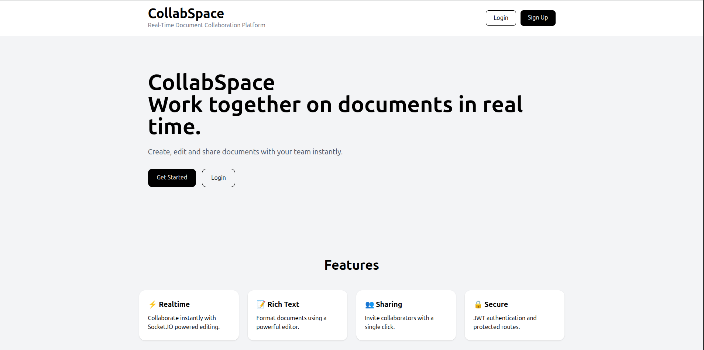
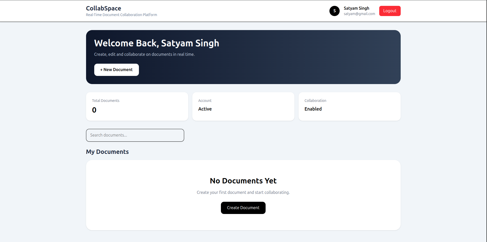
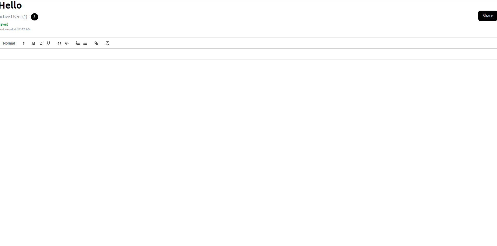
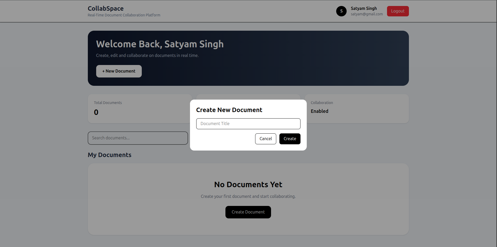
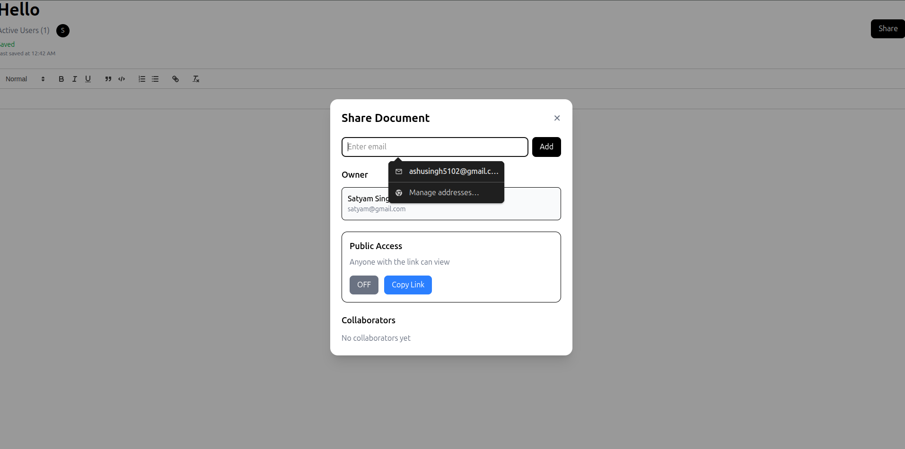

# CollabSpace

Google Docs–inspired real-time collaboration platform built with the MERN stack and Socket.IO.

CollabSpace enables teams to create, edit, and share documents while collaborating in real time. Users can invite collaborators, manage document access, and work together through a rich text editing experience.

## Live Demo

Frontend: https://collabspace-beta.vercel.app

## Features

### Authentication & Authorization

* JWT Authentication
* Secure Login & Registration
* Protected Routes
* User Session Management

### Document Management

* Create Documents
* Edit Documents
* Delete Documents
* Search Documents
* User Dashboard

### Real-Time Collaboration

* Socket.IO Powered Collaboration
* Live Document Updates
* Presence Indicators
* Multi-User Editing

### Sharing & Permissions

* Invite Collaborators
* Share Documents via Email
* Public Access Links
* Access Management

### Rich Text Editing

* Text Formatting
* Lists
* Links
* Headings
* Rich Text Controls

## Screenshots

### Landing Page

First impression for new users showcasing the platform and collaboration features.

### User Dashboard

Manage documents, search documents, and view shared content.

### Document Editor

Real-time collaborative rich text editor powered by Socket.IO.

### Create Document

Quickly create new collaborative documents from the dashboard.

### Document Sharing

Invite collaborators through email and manage document access permissions.

## Tech Stack

### Frontend

* React
* React Router
* Tailwind
* Axios

### Backend

* Node.js
* Express.js
* MongoDB Atlas
* Mongoose

### Realtime

* Socket.IO

### Authentication

* JWT
* bcrypt

## Project Structure

frontend/
server/
assets/

## Future Improvements

* Version History
* Document Comments
* Workspace Management
* Team Analytics
* Export to PDF

## Author

Paritosh Singh

Full Stack MERN Developer
